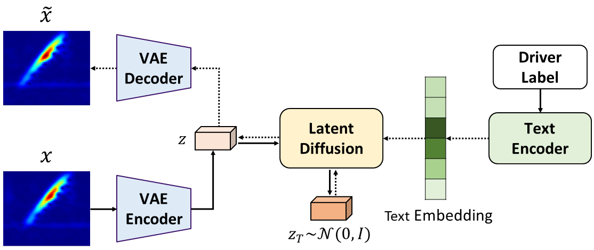

## D-Auth: Driver Authentication via Car-Speaker-Induced Vibration

## 💡 : Method

... 

## ⚙ : Setup
First create a new conda environment

    conda env create -f environment.yml
    conda activate ldm

## 💻 : Generation
You can launch the gradio demo by:

    python src/generate/generate.py
    
This command will load the downloaded pretrained weights and start the App. We include seven example local conditions: Canny edge, MLSD edge, HED boundary, sketch, Openpose, Midas depth, segmentation mask, and one example global condition: content. 

## ☕️ : Training

You should first download the pretrained weights of [Stable Diffusion](https://huggingface.co/runwayml/stable-diffusion-v1-5/blob/main/v1-5-pruned.ckpt) and put it to `./ckpt/` folder. Then, you can get the initial weights for training by:

    python utils/prepare_weights.py init_local ckpt/v1-5-pruned.ckpt configs/config.yaml ckpt/init.ckpt

The 4 arguments are mode, pretrained SD weights, model configs and output path for the initial weights.

Now, you can train with you own data simply by:

    python src/train/train.py