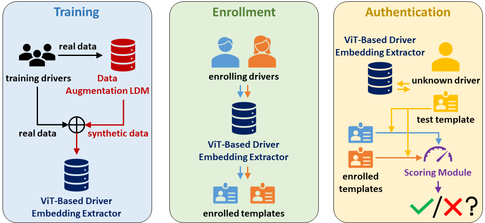

## D-Auth: Driver Authentication via Car-Speaker-Induced Vibration

## 🏛️ : Architecture

D-Auth is involved with three phases: training, enrollment, and authentication.

## ⚙ : Implementation
D-Auth is implemented by first training a ***Data Augmentaion LDM*** and then a ***ViT-Based Driver Embedding Extractor***. Please follow the instructions detailed in each folder's **README.md** file.
