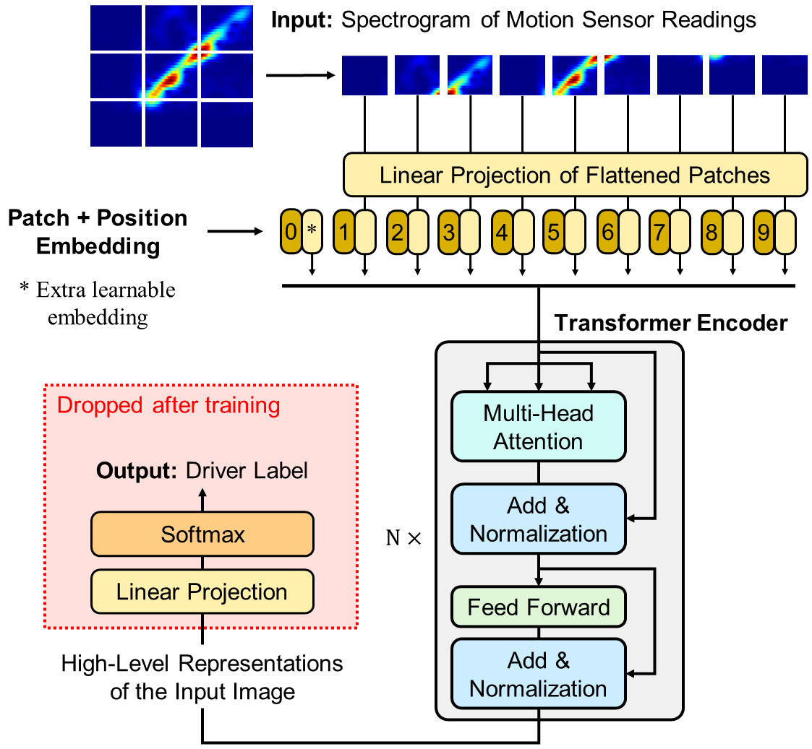

## Data Augmentation LDM

## 💡 : Method

During the training phase, the motion sensor data collected from a limited set of drivers (which we call the *training drivers*) are first used to train the ***Data Augmentation LDM***, which can generate diverse and representative synthetic data by learning the underlying distribution of the real data.

## ⚙ : Setup
First create a new conda environment

    conda env create -f environment.yml
    conda activate ldm

## ☕️ : Training
You should first download the pretrained weights of [Stable Diffusion](https://huggingface.co/runwayml/stable-diffusion-v1-5/blob/main/v1-5-pruned.ckpt) and put it to `./ckpt/` folder. Then, you can get the initial weights for training by:

    python utils/prepare_weights.py init_local ckpt/v1-5-pruned.ckpt configs/config.yaml ckpt/init.ckpt

The 4 arguments are mode, pretrained SD weights, model configs and output path for the initial weights.

Now, you can train with you own data simply by:

    python src/train/train.py

## 💻 : Generation
You can launch the generation by:

    python src/generate/generate.py
